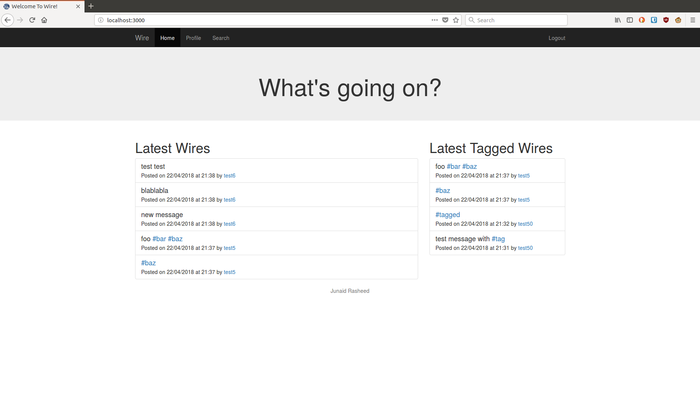
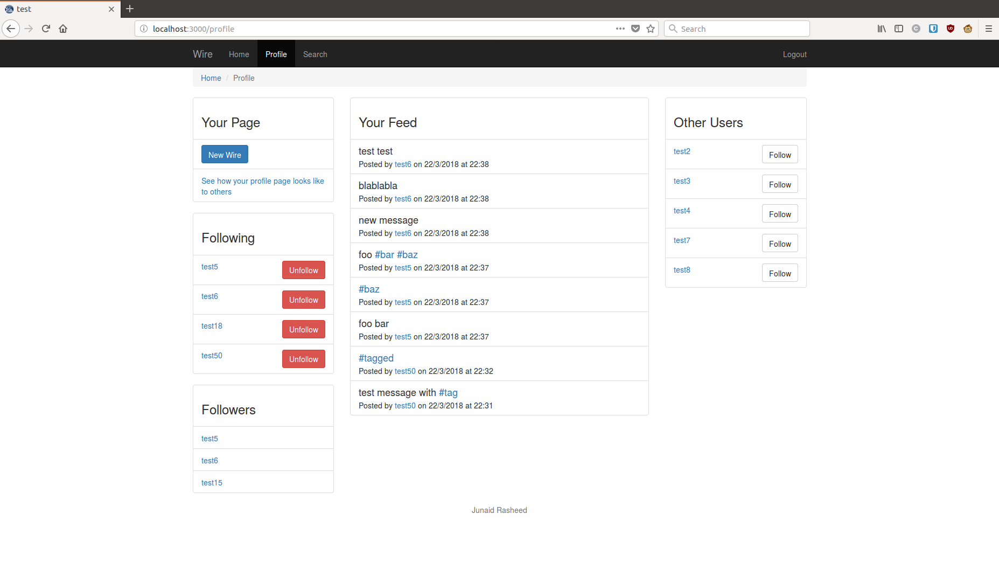
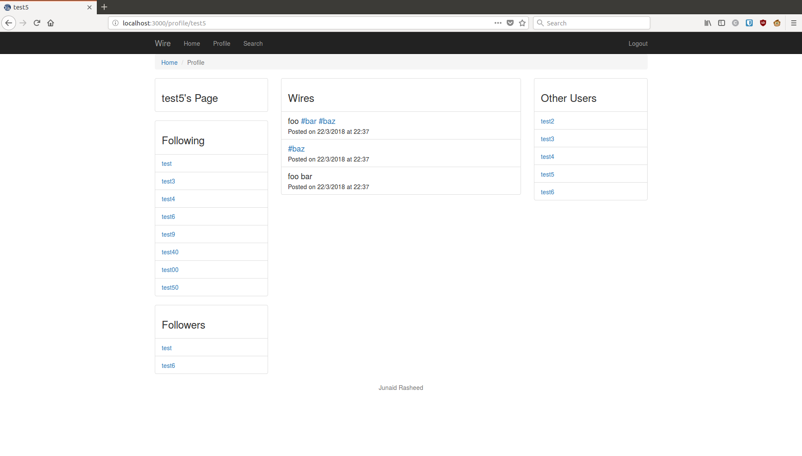
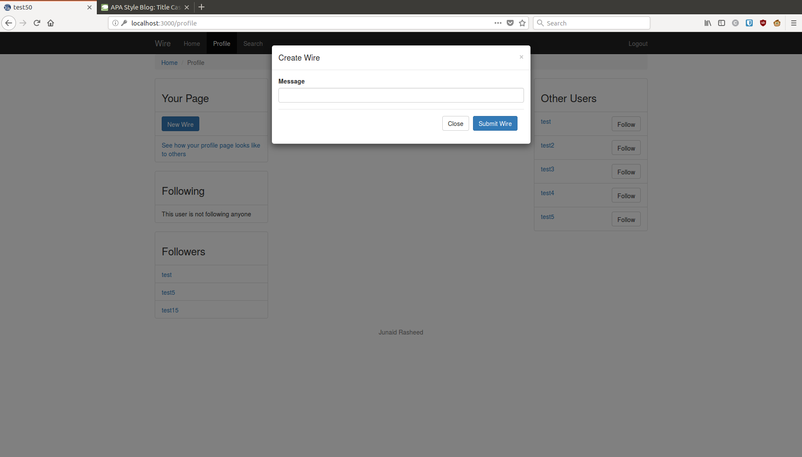
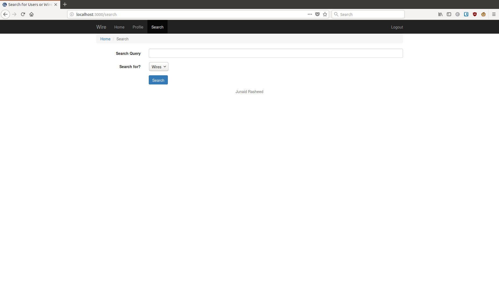

# Yesod vs Django: A Web Developers Comparison

This article is based on a thesis for the final year of my undergraduate course. The full thesis can be found
[here](final_report.pdf).

In this article, we provide a comparison of two web frameworks; a Haskell
framework called Yesod, and a Python framework called Django. This article
should help you decide whether or not a Haskell web framework is right
for you.

The Django and Yesod web frameworks have a similar set of features. This
ensured that we could make a functionally identical site in both of
these frameworks with a similar amount of effort. This enabled us to
make a fair comparison between Django and Yesod, enabling us to come to
a conclusion on whether a Haskell web framework may be a good choice for
a developer rather than a more traditional web framework.

## Learning the Frameworks

### Learning Django

Because of previous experience with Python and other object oriented web
frameworks, Django was learned quickly by going through the official
Django tutorials and documentation.

The Django tutorials themselves were straight forward for someone who
has experience in Python and other web frameworks. The tutorials walk
you through installing Django and creating your own app. In Django, an
app resides in a project and is a web application that performs some
function. An example of an app could be a web blogging system. A Django
project is a collection of apps and configuration settings for a
particular website.

### Learning Yesod

Coming from an object oriented background, it was not trivial to start
using a functional programming language like Haskell. Before development
with the Yesod framework could be started, the Haskell language had to
be learned to an adequate level.

To help with learning Haskell, the book "Haskell Programming from first principles" was used.
This book walks the reader through learning the Haskell language beginning
with the fundamentals. Reading through several chapters of the book
gives the reader a basic understanding of programming with Haskell,
allowing the reader start learning Yesod itself, referring to the book
to understand more advanced concepts as you come across them.

For Yesod, a [free book](https://www.yesodweb.com/book) is available on the Yesod website,
written by the person who wrote Yesod. The book goes through all of the features of the Yesod
framework in an easy to understand manner.

## The Website - Wire

The website that was created was a twitter clone names 'Wire'. Users
of the website can create messages, follow other users, and search
for users and messages. Here are some screenshots of what the website
looks like

### The home page



### The profile page for the current user



### The profile page for other users



### Form used to create a message



### The search page



## The Yesod Implementation

In this section, we will briefly discuss how the website was implemented
in Yesod. We will take a look at creating database entities, URL
routing, handling requests, creating templates, and writing tests.

### The Scaffold

When creating a new Yesod site, it is recommended to use the scaffolding
tool. The scaffolding tool generates code that sets up the structure of
your project. It creates the files needed to connect to a database and
launch a website. Sample code is included for developers to see how the
framework works. By running the scaffolding tool, it is clear to the
developer where source files, configuration settings, templates, and
static files should be kept. [@yesodBook Scaffolding and the Site
Template]

The Yesod codebase used for this project was built on top of code
generated by the scaffolding tool using the yesod-postgres template,
which tells the generated code to be compatible with a PostgreSQL
database.

### Yesod  Overview

The figure bloewgives you a high level overview of how
Yesod dispatches a request. By dispatch, we mean taking an incoming
request and then generating an appropriate response.


In the figure above, you can see that all requests go to the
`config/routes` file. This file is used to specify valid routes in an
application, and will forward all requests to an appropriate Handler.
[@yesodBook Understanding a Request]

A Handler is a more general term for a web application. Handlers are
Haskell files stored in the `src/` directory. These handlers are used to
interact with database entities, load an appropriate template file, and
then send a response to the user.

The models file located in `config/models` specifies all the database
entities in this web application. Each entry in this file generates a
database table and also creates helper functions for you to use in your
Haskell code. The handlers normally interact with these entities to deal
with certain requests. For example, if the user wants to log in to a
website, the request will go to the `Login` handler, which will check if
the credentials provided by the user is correct, and then generate an
appropriate response.

When a Handler needs to response with a HTML page, a template file is
normally used. A template file is a file with syntax similar to HTML
that defines the content of a HTML page.

### Defining Routes

As explained previously, URL routes are available routes in an
application and are specified in the `config/routes` file. In this file,
you specify whether a request from a route is a GET or POST request, the
handler that deals with the request, and any parameters that are part of
the request. One of the features of Yesod is type safety in URLs, so you
can specify the actual type that a URL parameter should be. If the user
tries to navigate to a page with an invalid parameter, a 404 page will
be shown. An extract from the ‘config/routes’ file can be seen in the code
block below.

```Haskell
-- This code block is an extract of the routes file. Each route is split into
-- three parts. The first part is the actual URL route that the user will
-- type. This route can contain a parameter which is mapped to a value from the URL.
-- The second part specifies a Haskell module that will deal with a request
-- from the given URL. The third part specifies the request types valid at this URL.
/profile MyProfileR GET POST
/profile/#Text ProfileR GET

/user UserGetAllR GET
/user-not-following UserGetAllExcludingFollowingR GET
/user/#Text UserGetAllExcludingUsernameR GET
/user/id/#UserId UserGetIdR GET
/users/*[UserId] UserGetIdsR GET
```

In the code block above, you can see that there are two
routes for the profile page. One, `/profile`, is for users viewing their
own profile page and the other, `/profile/#Text`, is for viewing the
profile page of another user. The `#Text` part of the route specifies
that there should be one parameter for this route with the type `Text`.
If multiple parameters are provided or a parameter is not of the type
`Text`, a 404 error is shown.

Further examples of URL parameters can be seen in the `user` routes.
`/user/id/#UserId` expects a user id as a parameter. If the specified id
is not found, a 404 page is shown. `/users/` expects a list of user ids,
which would look like `/users/1/2/3/4/`.

### Yesod Database Entities

Database entities are defined in the `config/model` file. In this file,
you give a name to the entity you want to create, the names and types of
it’s fields, functions that the entity and it’s fields should include,
and any fields that are unique, i.e. Cannot be shared with other
entities. Once an entity is added to this file, it is created in the
database when the codebase is compiled and helper functions are created
that can be used when programming. The code block below
contains the definition of the user entity extracted from the
‘config/models’ file.

```Haskell
User json key -- Specify the name of the entity and some helper functions
    username Text Eq -- Specify entity fields and their types
    email    Text Eq
    password Text
    UniqueUser username
    UniqueEmail email
    deriving Typeable Show -- Some Haskell helper functions
```

### Yesod Handlers

Every URL route in the application points to a handler. Handlers are
used to perform any calculations or queries that need to be done and
then respond to a request by rendering a template file, returning a JSON
object, or by redirecting to another handler.

The code block below is the handler used to respond to
get requests to display the profile page of the current user. The
handler ensures the user is logged in, loads the user’s details, and
then loads the template file. The variables that are available in the
handler are also available in the template file.

```Haskell
-- Loads the 'My Profile' page for the currently logged in user. If someone
-- who is not logged in attempts to access the page, a 404 error will be shown.
getMyProfileR :: Handler Html -- This function will respond to GET requests to the profile page
getMyProfileR = do
    (Entity userId user) <- requireAuth -- Get the current user's data from the database
    let username = userUsername user -- Extract username from the user

    -- Here, we generate a Haskell form to be used in a template file
    (formWidget, formEnctype) <- generateFormPost $ messageForm userId
    defaultLayout $ do -- Load the default layout that wraps around the loaded template
        setTitle . toHtml $ userUsername user -- Set the title of the profile page
        $(widgetFile "currentprofile") -- Load a template file
```

You may have noticed the message form being generated inthe previous code block. This form is defined in Haskell and the
source code can be seen below. When
defining the form, we give it a user id to specify the user creating a
message. We tell the form that there is one input field that is
required. Two hidden fields are also included to ensure the form has all
the data needed to create a message.

```Haskell
-- Here, we create a Bootstrap3 form for the Message entity
messageForm :: UserId -> Form Message
messageForm userId = renderBootstrap3 BootstrapBasicForm $ Message
    <$> areq textField (bfs ("Message" :: Text)) Nothing -- A required text field
    <*> pure userId -- A hidden field containing the userId
    <*> lift (liftIO getCurrentTime) -- A hidden field containing the current time
```

When the user submits the form, the post handler is ran (seen below).
In this handler, we use
the function `runFormPost` to check whether or not the form is valid. If
the form is valid, the message is added to the database and the profile
page is reloaded with a success message. If there’s an issue with the
form, the profile page is reloaded with an appropriate error message.

```Haskell
-- Create a new wire for the logged in user
postMyProfileR :: Handler Html
postMyProfileR = do
    (Entity userId _) <- requireAuth
    ((result, _), _) <- runFormPost $ messageForm userId -- Get the message form from the post request
    case result of -- Check whether or not the message form is valid
        FormSuccess message -> do
            _ <- runDB . insert $ message -- Insert the message typed in by the user
            setSession "msgrendered" "true"
            setMessage $ renderSuccessMessage "Wire Sent" -- Set a message to be shown to the user
            redirect MyProfileR -- Reload the profile page
        FormFailure errors -> do
            let renderedMessages = map renderErrorMessage errors -- Collect all the error messages
            setSession "msgrendered" "true"
            setMessage $ toHtml renderedMessages -- Set the error messages to be shown to the user
            redirect MyProfileR
        FormMissing -> do
            setSession "msgrendered" "true"
            setMessage $ renderErrorMessage "Form is missing"
            redirect MyProfileR
```

If a route contains a URL parameter, the handler must also have a
parameter to store the value of the given parameter. The code block
below is the source code for a handler that takes
in a user id as a parameter. As you can see, we do not have to check for
the type of this parameter or whether it is not null. We specified the
type of the URL parameter in the routes file so Yesod will perform type checking for us,
saving developers time from having to manually deal with invalid types
or values.

```Haskell
-- | Takes in a user id and returns data on the user matching the given id.
-- If no user is found, an empty JSON object is returned.
getUserGetIdR :: UserId -> Handler Value
getUserGetIdR userId = do -- Here, userId is a parameter from the URL
    users <- runDB $ selectList [UserId ==. userId] [] -- Load the user with the given user id from the database
    -- The map in the line below extracts the username from the user object and
    -- stores this in a new object called cleanUsers. This ensures that the
    -- user's email and (hashed) password is not given in the response.
    let cleanUsers = map (\(Entity uid (User uname _ _)) -> (object ["id" .= uid, "username" .= uname])) users
    returnJson cleanUsers
```

### Yesod Templates

The templates used in Yesod are called Shakespearean templates.
Shakespearean templates allow you to write type-safe templates that are
compiled, helping prevent runtime errors. The syntax for Shakespearean
templates are similar to the languages they are based on, with minor
syntax changes. For example, the HTML template language, Hamlet, uses
indentation rather than opening and closing tags to denote nesting.
Within these templates, you can use Haskell variables, create type-safe
routes, and implement conditional and looping logic. [@yesodBook
Shakespearean Templates]

When a template file is loaded in a handler, the file is actually
included inside a default file. The default file contains content that
is common to all pages. This ensures that code does not need to be
repeated, reducing the chance of mistakes and making it easier to change
the layout of the whole site.

A simple template file can be seen below.
In this block, you can see how indentation
is used to determine nesting. Variable interpolation is done using
`#{variableName}`. You can see the form is being loaded using , which
renders the given widget onto the page. Type safe URLs are loaded using
`@{routeName optionalParameters}`.

```HTML
<main>
    <div .container>
        <div .row>
            <div .col-sm-12>
                <form #search-form .inline .form-horizontal role=form method=post action=@{SearchR} enctype=#{formEnctype}>
                    ^{formWidget}
```

### Yesod Tests

The Yesod test suite allows you to create BDD-style tests. When creating
a test, you specify what it should do, create any database entities you
need, make a request to a handler, and examine the response to see if
the data you received is correct. The code block
below is an actual test from the website. The
test creates and logs in as a new user, loads the profile page, and
ensures that the resulting HTML contains the text that it should
contain. Yesod gives you the ability to use CSS selectors when checking
the HTML page given by a response, allowing you to be very specific.

```Haskell
it "asserts that the current profile page looks right" $ do
    foo <- createUser "foo" "foo@bar.com" "foo"
    authenticateAs foo

    get MyProfileR
    htmlAnyContain "h3" "Your Page"
    htmlAnyContain "h3" "Your Feed"
    htmlAnyContain "h3" "Followers"
    htmlAnyContain "h3" "Following"
    htmlAnyContain "h3" "Other Users"
```

The testing suite also has the ability to check if a JSON response
contains the data that we expect. However, you do not have the same
helper functions available to you when compared to checking HTML
responses. When checking JSON response, you must examine the body of the
response itself. You cannot check if a JSON key has a given value.

```Haskell
it "asserts all users are returned when not authenticated" $ do
    _ <- createUser "foo" "foo@bar.com" "foo"
    _ <- createUser "bar" "bar@bar.com" "foo"
    _ <- createUser "baz" "baz@bar.com" "foo"

    get UserGetAllR

    bodyContains "username"
    bodyContains "id"
    bodyNotContains "email"
    bodyNotContains "password"
    bodyContains "foo"
    bodyContains "bar"
    bodyContains "baz"
```

## The Django Implementation

Now, we will discuss how the Django site was implemented. We will go
through Django apps, routes, entities, views, templates, and tests.

### Creating a Project

All Django sites require a Django project. A project is a directory that
contains all the settings needed for a Django website. This includes
database settings, the apps being used, application settings, and
Django-specific settings. To create the project, the `django-admin` tool
was used. This tool generates the code needed to connect to a database
and start a Django site.

### Creating Apps

The code used for the actual web application resides in two Django apps,
`base` and `wire_profile`. In Django, an app is a web application that
can be a part of a project. These apps contain the URL routes used in
the application, database entities, views that respond to requests,
templates, and tests. The `manage.py` tool provided by Django was used
to create apps. This tool creates a directory with a specified name and
a layout of files and directories that is preferred for Django apps.

### Django Overview

This subsection will give you a high level overview of how Django works.
The figure below shows you how Django generates a response
from a user’s request. In the diagram, you can see that all requests
first go to the `urls.py` file. In this file, a request is matched with
an entry in the file, and this entry forwards the response to an
appropriate view.

{width="70.00000%"}

A view is python function that takes in a request and generates an
appropriate response. A valid response could be a HTML page, an HTML
error, JSON data, etc. To generate an appropriate response, a view may
interact with a model, or it may need to load a template file. Views are
defined in the `views.py` file.

Models, located in `models.py` are used to define database entities in
an application. Each entry is written as a class and is mapped to a
table in the database. Views interact with these models to read or write
data to the database.

Template files are simply files written in HTML that define the content
of a page. Views use template files to render an appropriate response if
the response is a HTML page.

### Routes

Django routes are specified in the `urls.py` file within an app. The
routes specify a URL path, a view that responds to requests from the
given path, and a name that is used to refer to a route within code.
Django routes can contain URL parameters, like Yesod. The valid values
for these parameters can be defined using regular expressions or a few
built in types like `string` or `int`. To denote a list of parameters,
`<path:parameterName>` can be used. An example of Django routes can be
seen in code block below.

```Python
# The path function below takes in three variables. The first
# variable is the URL path for the request, the second parameter
# links to a view that will handle a request, and the third
# parameter is the name for the route that can be used in Python code
path('following/<path:username>', views.get_following, name='get_following'),
path('users/<path:user_ids>', views.get_user_ids, name='get_user_ids'),
path('user/id/<int:user_id>', views.get_user_id, name='get_user_id'),
path('search', SearchView.as_view(), name='search'),
```

### Django Database Entities

Database entities are defined as classes in the `models.py` file within
an app. The variables inside each class are used to determine the names
and types of entity’s fields. When an entity is created or modified,
Django migrations must be created and then ran using the `manage.py`
tool. Migrations are used by Django to ensure changes you make to models
are executed in the database schema. [@djangoMigrations].

```Python
class Message(models.Model):
    message_text = models.CharField(max_length=280)
    created = models.DateTimeField('created')
    user = models.ForeignKey(User, on_delete=models.CASCADE)

    def __str__(self):
        return self.message_text
```

### Views

Views in Django are similar to Handlers in Yesod, they are used to
create a response for a given request. There are two main types of views
that you can create in Django, class-based views and function-based
views. The Django website produced contains a mixture of class-based and
function-based views.

The code block below is an example of a class-based view used
to render the profile page for the current user. In this view, we check
if the user is authenticated and then render the profile page for the
authenticated user. If the user is not authenticated, we redirect them
to the home page and show an error message.

```Python
class CurrentProfileView(TemplateView):
    template_name = "wire_profile/current_profile.html"

    def get(self, request, *args, **kwargs):
        """
        Get the current profile if the user is logged in.

        :param request: The current request
        :param args: sent to parent method
        :param kwargs: sent to parent method
        :return: Either redirect to the search page or render the profile page
        """
        if request.user.is_authenticated:
            context = self.get_context_data(**kwargs) # context is a map of objects that can be used in the template
            form = NewWireForm()
            context['form'] = form
            context['user'] = request.user
            return self.render_to_response(context)
        else:
            messages.error(request, 'You must log in to view your profile page', extra_tags='danger')
            return HttpResponseRedirect(reverse('base:home'))
```

In the current profile view, we load a Django form for a user to create
a message, just like we do in Yesod. This form is located in the
`forms.py` file. The form is a class where variables map to input
names. The Django form only requires one field, the message. No hidden
fields are used to determine the user that created a message, this is
done in the view itself.

```Python
class NewWireForm(forms.Form):
    message = forms.CharField(widget=forms.Textarea(attrs={'rows': '3', 'cols': '40'}), label='Message', max_length=280)
```

When the form is submitted, a post request is sent to the function-based
view seen in the code block  below. In this view,
the following conditions are checked: whether or not the request type is
POST, the validity of the form, and whether or not the user is
authenticated. If these conditions are true, the message is created and
saved to the database. If not, an appropriate error message is rendered.

```Python
def create_message(request):
    """
    Create a message for the logged in user

    :param request: The request sent by the user
    :return: Display the profile page with a relevant message
    """
    if request.method == 'POST':
        form = NewWireForm(request.POST) # Get the form data from the request
        if form.is_valid():
            if request.user.is_authenticated:
                message = form.cleaned_data['message'] # Retrieve the message from the form data
                try:
                    Message.objects.create(message_text=message, created=timezone.now(), user=request.user) # Save the message in the database
                    messages.success(request, 'Message created successfully', extra_tags='success')
                    return HttpResponseRedirect(reverse('wire_profile:current_profile'))
                except DatabaseError:
                    messages.error(request, 'Error creating message, please contact support', extra_tags='danger')
                    return HttpResponseRedirect(reverse('wire_profile:current_profile'))
            # ... each else condition renders an appropriate error message
```

The method to retrieve URL parameters in Django differs depending on the
type of view you use. For class-based views, URL parameter values are
retrieved using the `kwargs` variable available in all class-based
views. For function-based views, a parameter is added to the function itself.

```Python
def get_user_ids(request, user_ids):
    """
    Get the users with the given IDs in JSON format

    :param request: The request that called this function
    :param user_ids: The user ids to get the users for
    :return: list of users in JSON format
    """
    user_ids_list = filter(bool, user_ids.split('/'))
    user_ids_list = list(map(int, user_ids_list))
    % users = User.objects.filter(pk__in=user_ids_list).values('username')
    return JsonResponse(list(users), safe=False)

class SearchMessageView(TemplateView):
    template_name = 'wire_profile/search_message.html'

    def get(self, request, *args, **kwargs):
        """
        Render the matching messages for a search message query

        :param request: The current request
        :param args: sent to parent method
        :param kwargs: sent to parent method
        :return: Render the search message results page
        """
        query = self.kwargs['query']
        search_results = Message.objects.filter(message_text__icontains=query).all()
        context = self.get_context_data(**kwargs)
        context['search_results'] = search_results
        return self.render_to_response(context)
```

### Django Templates

The Django template language can be used in any HTML, CSS, and
JavaScript file. The Django template language can be used to perform
variable interpolation, conditional checks, loops, and creating default
blocks of code that can be reused in other templates. Rendering these
files executes the the template logic that the file contains.

```Django







    {{ block.super }}
    



    Search



<main>
    <div class="container">
        <div class="row">
            <div class="col-sm-12">
                <form id="search-form" class="inline form-horizontal" role=form method=post action="/search">
                    
                    
                </form>
            </div>
        </div>
    </div>
</main>

```

The cobe block above is the source code for
the template file used to render the search page. In this file, a base
template is loaded, which is a full HTML page with the content divided
up into a number of blocks. These blocks are then overridden in the
search template to define breadcrumbs, set the page title, and write the
markup for the main content of the page. Laying out template files like
this eliminates repetitive code and keeps the Django template files
similar to their Yesod counterparts, reducing the need to design
different templates in both frameworks.

### Django Tests

Django tests are contained in the `tests.py` file within an app. Tests
are functions within a class. The process for testing in Django is
similar to Yesod: we create any needed database entities at the
beginning of a test, make a request, and check to see if the response is
what we expect. The code block below is a test
where a user account is created, logged in, and then the profile page
for the user is loaded. Django does not have the functionality available
in Yesod that allows you to test the content of a HTML page using CSS
selectors, so instead, we test that the correct template is being loaded
with the expected template variables.

```Python
class CurrentProfileViewTest(TestCase):
    # Other tests...
    def test_current_profile_page_for_logged_in_users(self):
        user = User.objects.create_user('testfoo', 'test@test.com', 'test')
        self.client.post(reverse('base:verify'), {'username': user.username, 'password': 'test'})
        response = self.client.get(reverse('wire_profile:current_profile'))

        self.assertEqual(response.status_code, 200)
        self.assertEqual(response.context['user'], user)
        self.assertIsInstance(response.context['form'], NewWireForm)
        self.assertTemplateUsed(response, 'wire_profile/current_profile.html')
```

In Django, we can still examine the content of a response, as seen below.
In this block, we make a
JSON request, decode the response, and ensure that the response content
contains the expected data.

```Python
class GetUserIdsTest(TestCase):
    # Other tests...
    def test_get_user_ids_one_user(self):
        user = User.objects.create_user('foo', 'test@test.com', 'test')
        user2 = User.objects.create_user('bar', 'bar@test.com', 'test')
        user3 = User.objects.create_user('baz', 'baz@test.com', 'test')

        response = self.client.get(reverse('wire_profile:get_user_ids', kwargs={'user_ids': str(user.id) + '/'}))
        response_content = response.content.decode()

        self.assertEqual(response.status_code, 200)
        self.assertIn('"username": "' + user.username + '"', response_content)
        self.assertNotIn('"username": "' + user2.username + '"', response_content)
        self.assertNotIn('"username": "' + user3.username + '"', response_content)
```

## Comparison of Django and Yesod

This section consists of a comparison of both frameworks. A series of
experiments were conducted as specified in the plan, the raw results of
which can be found in the appendix of the [original thesis](final_report.pdf). These results will be discussed along
with features and limitations of both frameworks that stand out.

To ensure that the results we collected were as fair as possible, two
Amazon EC2 servers were created. The configuration of both servers were
identical, with them having 1GB of RAM and 1 CPU core available. The
tools necessary to deploy the website were installed on both servers and
both sites were released on the server, allowing testing to begin.

### Deployment

Deploying a Yesod onto an Amazon EC2 app is very simple. Yesod has
built-in support for a tool called Keter, a Haskell application that can
act as a web server. After Keter was installed and configured on the
Amazon EC2 server, a Keter binary was created using commands built-in to
Yesod. This binary file can simply be transferred onto the server, and
Keter will start serving the web application to visitors.

For the Django website, nginx, an open source web server was installed.
nginx acts as a reverse proxy to the Django application, which is being
run by a tool called Gunicorn (‘Green Unicorn’). Gunicorn is a WSGI
(‘Web Server Gateway Interface’) tool that can be used on Unix systems.
This means that Gunicorn can allow nginx to use Django
to serve the web application.

### Page Load Speed

When testing page load speeds, each page was loaded three times. The
time taken for each run was recorded as well as an average. In this
section, we will be discussing the average times that were recorded.

Page load speeds for Yesod are noticeably quicker than Django, with
Yesod loading most pages around 200ms faster. For example, on average,
the home page takes about 511ms to load in the Yesod framework, and
750ms to load in the Django framework. Creating a new message and then
redirecting back to the profile page takes about 679ms in Yesod and
849ms in Django.

Page                         |   Average Speed in Yesod (ms) |  Average Speed in Django (ms)
-----------------------------| ----------------------------- |------------------------------
Home Page                    |                        511.00 |                        753.33
Search Page                  |                        517.33 |                        756.33
Login Page                   |                        443.67 |                        821.33
Signup Page                  |                        490.33 |                        764.00
Creating an Account          |                        504.33 |                        748.67
Logging in to an Account     |                        547.33 |                        722.67
Logging out                  |                        510.33 |                        761.33
Current user’s Profile Page  |                        617.00 |                        930.00
Other user’s Profile Page    |                        651.33 |                        908.67
Creating a Message           |                        679.33 |                        848.67
Search for a Message         |                        513.33 |                        766.33
Search for a User            |                        519.00 |                        756.67

As you can see the table above, Yesod
consistently outperforms Django. This could be for a number of reasons:
Yesod automatically minimises static files like CSS or JavaScript;
Haskell is compiled rather than interpreted, and compiled code generally
runs faster than interpreted code; the lazy evaluation of Haskell may
give some speed improvements; and the Keter tool used on the server is
made specifically for Haskell web applications, which may mean that
Yesod and Keter will run faster than Django and nginx.

### Load Tests

Load tests were conducting using a tool called RedLine13. RedLine13 is a
service that allows users to perform load testing using Amazon EC2
servers. With RedLine13, I was able to send requests from an Amazon EC2
server to the Yesod and Django websites. To keep within the usage limits
of RedLine13 and Amazon EC2, three load tests were conducted. Each test
had 80 users load a specific page in a short amount of time, typically
25 seconds. The results of these tests can be found in table
 \[tab:loadTests\].

Page             | Yesod (s)  | Django (s)
-----------------| -----------| ------------
Home             | 4.96       | 5.54
Profile 1st Run  | 5.05       | 4.94
Profile 2nd Run  | 4.97       | 5.13
Average          | 4.99       | 5.20

As you can see in the table above, Yesod is around 200-500ms faster than
Django when under load. This difference is consistent with the results
found in our previous experiment. The high loading times seen in
these tests is probably because the servers being used are not very
powerful.

The tests also recorded the total amount of data downloaded for all
users. Yesod beat Django by a sizeable margin in this test, with Yesod
sending, on average, 6.46MB of data per test and Yesod sending 18.19MB
of data. This is because Yesod, by default, compresses all static files.
If we load the home page of both websites, Yesod transfers 76.83kB of
data which is decompressed to 246.57kB being stored on the disk. Django,
on the other hand, transfers 243.49kB of data.

### Resource Usage

Resource usage on both servers was measured after running the
page load speed experiments. All the
information in this section was obtained by examining output from htop,
a process viewer. On the server running Yesod, 109MB of RAM was being
used. The server running Django used 125MB of RAM.

To run a web server on the Yesod server, Keter creates two
sub-processes. One of these sub-processes loads the compiled code for
the website, and the other loads the configuration file for the web
server. Altogether, these three processes use about 83MB of RAM in
total, with 56MB of RAM being shared.

On the Django server, gunicorn, when executed with the default settings,
creates one sub-process. These two processes use around 65MB of RAM and
share 19MB of RAM. nginx is not very memory intensive, using 6MB of RAM,
sharing 3MB. In total, the Django server uses 71M of RAM, sharing 22MB.

Yesod is ahead of Django when it comes to resource usage. Even though
all the Keter processes use more memory than gunicorn, most of the
memory used by Keter is shared, resulting in the overall memory usage in
the Yesod server being lower than the Django server. The RAM usage of
the Django server is 16MB more than the Yesod server, but this
difference is negligible considering the resources available to most
servers at this time.

### Continuous Integration

For the duration of this project, all programming has been done on a git
repository stored on GitHub. Travis CI, a continuous integration tool,
syncs with GitHub in order to run tests on the repository every time
there is a new commit. The way this works is that every time a commit is
pushed to GitHub, GitHub sends the details of the commit to something
called a Webhook. Travis gets an update from this Webhook, and executes
a file called `.travis.yml` placed in the root of the repository. This
file contains instructions telling Travis how to run the tests on the
codebase.

Yesod did take longer to run tests when compared to Django. The Django
repository took around 2.5 minutes to build and run all the tests. Yesod
took around 3.5-4 minutes. For continuous integration, this difference
is negligible as any code will be peer reviewed in a real life before
being merged in to the main branch. For developing however, Django does
speed things along when you’re implementing a new feature in a test
driven way and are running the test suite multiple times to ensure your
feature works and does not unintentionally break other features.

### Debugging

When developing, you sometimes make mistakes. When you make these
mistakes, ideally, you would want to see an error message that tells you
where you made the mistake and some information about the error itself
which may help you resolve this mistake. As part of evaluating Yesod and
Django, simulated mistakes were made in both frameworks.

The first simulated mistake we made was, when creating a message, try to
save the form data object into the database rather than the actual
message stored inside this object. The code change in Yesod can be seen
in first code block below, and the Django change can be
seen in the second code block.

```Haskell
(Entity userId _) <- requireAuth -- get the user id
((result, _), _) <- runFormPost $ messageForm userId -- get the form data
case result of
    FormSuccess message -> do -- if it's a valid form, get the message
        -- _ <- runDB . insert $ message -- original line, insert message
        _ <- runDB . insert $ result -- new line, insert form data
```

```Python
form = NewWireForm(request.POST) # get the form
if form.is_valid():
    if request.user.is_authenticated:
        message = form.cleaned_data['message'] # form.cleaned_data is a map of form values
        try:
            # Message.objects.create(message_text=message, ..) # original line, store the message
            Message.objects.create(message_text=form.cleaned_data, ..) # changed line 1, store form values
            # Message.objects.create(message_text=form, ..) # changed line 2, after previous line passed, store form object
```

For Yesod, the simulated error caused a compilation error (shown below), with the
exception message complaining about mismatched types. For Django, however, no exception was thrown,
even when submitting the message. Further investigation showed that
Python was converting the form data into a string, and then saved this
string in the database. Because the message was saved in the database,
the tests, which at the time only checked the amount of objects in the
message table, passed. This test was later amended to check the actual
content of the message, and failed appropriately when the mistake was
reintroduced.

```Message
- Couldn't match type `PersistEntityBackend (FormResult Message)'
with `SqlBackend'
arising from a use of `insert'
- In the second argument of `(.)', namely `insert'
In the expression: runDB . insert
In a stmt of a 'do' block: _ <- runDB . insert $ result
```

In the second test, we simply misspelled a variable name. This would
normally be caught by most editors but it would be useful to see the
error message produced as a result of a particularly common mistake.
This mistake was done in the piece of code that returns data for
recommended users in JSON format. This is used as part of an AJAX
request to display recommended users to the user on the profile page.
As before, the first code block shows the Yesod change and the second
code block is the Django change.

```Haskell
Entity userId user <- requireAuth
followers <- runDB $ selectList [FollowFollowerId ==. userId] []
-- See: https://stackoverflow.com/questions/36727794/haskell-persistent-reusing-selectlist
let followingIds = map (\(Entity _ (Follow _ followingId)) -> followingId) followers
users <- runDB $ selectList [UserUsername !=. userUsername user, UserId /<-. followingIds] [LimitTo 5]
let cleanUsers = map (\(Entity uid (User uname _ _)) -> (object ["id" .= uid, "username" .= uname])) users
-- returnJson cleanUsers -- original line
returnJson cleanUser -- new line
```

```Python
if request.user.is_authenticated:
follow_query = Follow.objects.filter(follower_id=request.user)
users = User.objects.filter().exclude(id=request.user.id).exclude(username=excluded_username)\
    .exclude(followed_user__in=follow_query).values('username')[:5]
# return JsonResponse(list(users), safe=False)  # original line
return JsonResponse(list(user), safe=False)  # new line
```

The change caused a compilation error in Yesod. The exception message
complained about the misspelled variable not being in scoped, and
actually recommended the correct variable that should have been used.
For Django, the recommended users section did not load in the Profile
page. Checking the network tab of the web developer tool built into the
browser showed that the AJAX request responded with a 500 error. Loading
the URL used in the AJAX request displayed an exception, with a stack
trace and a message that said “name ‘user’ is not defined”.

```Message
Variable not in scope: cleanUser
Perhaps you meant `cleanUsers' (line 19)
```

### Documentation

The book, , will teach you almost all the features of the Yesod
framework. The book has a lot of detail of how every feature in Yesod
works, including templates, database entities, routing, and deployment.
If the reader is familiar with Haskell, the book will give you the base
knowledge needed in order to start developing a Yesod website.

The problem with Yesod is that outside of topics in the book, the
documentation of libraries used is, most of the time, not very detailed.
Most of the documentation for these libraries are a couple of lines
explaining what a function does and a Haskell type signature. For more
experienced Haskell programmers, most of the time, this is all you need
to figure out how to use a function. You can also examine the source
code if you need more information on how a function works. However, for
developers who are new to Haskell, examples and detailed explanations
like the one given in the book are invaluable. This resulted in a lot of
time being spent towards the beginning of the project trying to fix
errors that would be trivial for more experienced developers. As the
project progressed further, the documentation and type signatures
provided by external libraries became easier to understand as knowledge
of Haskell increased.

The Django project also has excellent documentation. There are tutorials
for beginners to get started with Yesod, tutorials for deploying Django
websites, and documentation on almost all functions in the framework.
Most of the documentation also contain usage examples which are
invaluable for beginners who want to easily see how a function works.
This is a definite advantage that Django has over Yesod. The Yesod book
does have great usage examples but the documentation for external
libraries is lacking.

### Community

Django has millions of users. This means that any issue you come across,
someone else has most likely already encountered and solved. This means
that a lot of the time, when you come across an issue, you can just
search for the error message and come across forum posts discussing
solutions for the exact same error that you are having.

Yesod, on the other hand, has a much smaller community. It is likely
that you are the only person experiencing a certain issue. Because of this, beginners will likely
find it harder to solve issues with Yesod when compared to Django.

Although the Haskell community is small, experienced developers are
almost always available to help beginners with issues if they make a
post on an appropriate forum. In fact, with Yesod, you often see Michael
Snoyman, the person who wrote the framework, answering questions posted
by beginners. Developers can also join the \#haskell-beginners IRC
channel where they can speak to an experienced developer about their
issues in real time.

### Conclusion

After running all of our tests, we can see that a relatively niche
framework like Yesod can keep up with a giant like Django. If you’re an
experienced Haskell developer and are looking for a web framework to use
for your project, then Yesod is a great choice. The documentation for
Yesod itself is excellent, it is being used in the real world on
websites that get millions of visitors, and the community is great when
you are experiencing an issue.

Performance-wise Yesod is faster and less resource intensive than
Django. This is most likely because of the fact that Haskell is a
compiled language, and compiled languages are generally faster than
interpreted languages, like Python. If your primary concern when it
comes to choosing a web framework is performance, then Yesod is a great
choice.

For Haskell beginners or people who have no experience in Haskell, you
should only decide to use Yesod if you are willing to dedicate a lot of
time to learn Haskell and the framework itself. Yesod is a nice
framework to use if you’re an experienced Haskell developer, but it can
be frustrating for beginners. You will find it hard to understand why
your code won’t compile, some of the documentation of external libraries
is poor, and you will not understand how a lot of the advanced Haskell
features being used in Yesod work. If you need to find a web framework
to start working on right away, then Yesod is not for you. If you are
willing to learn Haskell and the framework itself, then Yesod is a great
choice. The Haskell community is friendly towards beginners and will be
willing to help you if you are experiencing issues, and developing a
Yesod application is a great way to develop your Haskell knowledge.

As shown in the tests where we simulated common development errors,
Yesod is very robust. It will not compile at all if there is a
mismatched type, saving you from having to write tests to detect when a
mismatched type occurs. Because Python uses type coercion, Django is
more flexible in this regard. This may save time when developing but it
may cause unexpected errors as seen in our tests. This is a matter of
personal preference, some developers will prefer the flexibility that
Python’s dynamic types give you, and others will prefer the robustness
of Haskell’s static types and type safety.

In conclusion, Yesod is a production ready framework. It is used in the
real world, can keep up and sometimes outperform other popular
frameworks, has great documentation, and has a helpful community.
